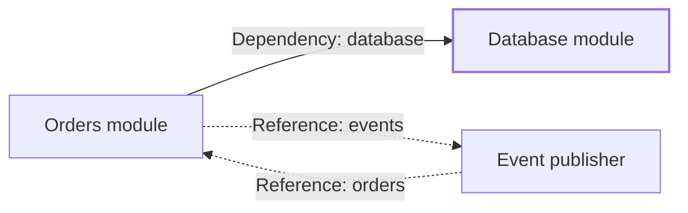

# Core concepts

## The application

`MicrodeApplication` owns the installed modules and coordinates their lifecycle. Its `state` property exposes the current phase, and its execution result reports an exit code plus any failures encountered while running or unwinding the application.

## Modules

Every module owns one focused part of an application and implements lifecycle methods:

1. `initialize` acquires resources needed to configure the module.
2. `setup` connects the initialized module to the application.
3. `run` performs the module's work.
4. `stop` asks running work to finish.
5. `teardown` reverses setup.
6. `shutdown` releases initialized resources.
7. `cleanup` performs final cleanup in every execution path.

For named compositions, dependency providers initialize and set up before consumers. Run callbacks start in the same deterministic order but remain concurrent. Stop is dispatched in reverse order; teardown, shutdown, and cleanup run sequentially in reverse order. Unrelated modules use stable instance IDs as the tie-breaker.

## Composition and module identity

Named installation returns an opaque `ModuleHandle` for one exact installed instance. Handles do not expose module objects. Stable IDs must be unique within an application and make ordering independent of installation order.

Modules declare `Dependency` and `Reference` slots against nominal runtime `Port` tokens and export owned contract values through providers. `MicrodeApplication.bind()` binds every slot to an exact installed handle; providers are never selected implicitly by type.

Calling `serve()` or `run(main)` seals composition. Microde validates all bindings, rejects dependency cycles, computes lifecycle order, stages providers, and atomically publishes the complete resolution table before initialization. Invalid composition starts no lifecycle callback.

Dependencies form the lifecycle DAG and are available through `SetupContext` and `RunContext`. References do not affect lifecycle order, may form cycles, and are available only through `RunContext`.

The solid dependency determines lifecycle order: the database starts before
orders and stops after it. The dotted references can form a cycle because they
are resolved for `run` without changing lifecycle order.

## Module context

Every module receives a `MicrodeContext` through its constructor. The base module makes it available to subclasses as the protected, read-only `context` property. The context deliberately contains only the application operations a module needs:

- `requestStop()` requests an orderly stop without waiting for the overall lifecycle result. Its optional request object can contain an exit code, error, or both.
- `panic()` terminates immediately when normal lifecycle cleanup would be unsafe.

`MicrodeApplication` owns a dedicated object that implements this contract and supplies it to module factories. Modules should accept `MicrodeContext` rather than depend on the concrete lifecycle coordinator. This keeps modules focused and makes them easier to test with a minimal context substitute.

## Passive modules

A module declares `ModuleKind.Passive` when its `run()` promise completes on its own. When a served application has only passive modules, it begins stopping modules after every module settles.

## Active modules

A module declares `ModuleKind.Active` when it represents a long-running component. If an active module finishes, a passive module fails, or the application receives a stop request, Microde asks every module to stop in reverse lifecycle order before unwinding the lifecycle.

The active module's `stop()` implementation should cause its `run()` promise to settle.

## Execution results

Successful execution returns `{ exitCode: 0 }`. A lifecycle or execution failure normally returns exit code `1`, the primary `error`, and—when multiple failures occur—an `errors` array in priority order.
