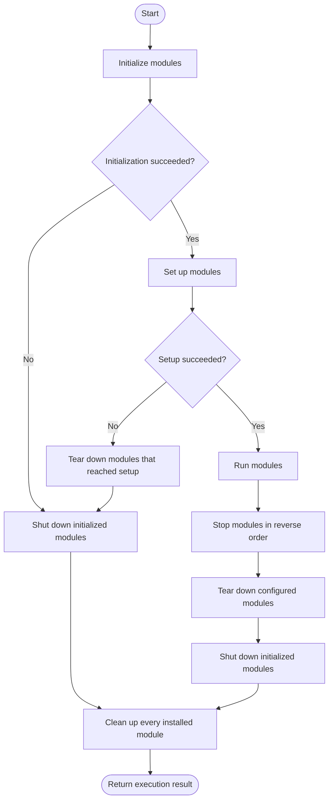

# Module lifecycle

Use each lifecycle phase for a distinct level of resource ownership.

| Phase        | Purpose                                        | Order                                                          |
| ------------ | ---------------------------------------------- | -------------------------------------------------------------- |
| `initialize` | Acquire resources and prepare local state      | Dependency-first order                                         |
| `setup`      | Connect the module to other service components | Dependency-first order                                         |
| `run`        | Perform finite or long-running work            | Invoked in dependency-first order; runs may overlap            |
| `stop`       | Ask running work to finish                     | Dispatched in reverse order; waits retain existing concurrency |
| `teardown`   | Undo setup                                     | Sequential reverse order                                       |
| `shutdown`   | Release initialized resources                  | Sequential reverse order                                       |
| `cleanup`    | Perform unconditional final cleanup            | Sequential reverse order                                       |

For modules without dependency edges, stable instance IDs provide the
tie-breaker, so installation order does not change the lifecycle trace. Calling
`serve()` and `run(main)` seal the composition before any lifecycle callback starts. Dependencies
are available in `setup` and `run`; references are available only in `run` and
do not affect ordering.

## Partial startup

Microde tracks how far each module progressed. If initialization fails, only modules that reached initialization are shut down, but every installed module is cleaned up. If setup fails, only modules that reached setup are torn down.

This lets lifecycle methods assume that their corresponding forward phase was reached. Cleanup is the exception: it must be safe after any earlier outcome.

## Implementation guidance

- Keep lifecycle methods idempotent where practical.
- Let errors propagate; Microde records them and continues the appropriate unwind phases.
- Do not call `panic()` for recoverable lifecycle failures because it exits the process without unwinding.
- Ensure an active module's `stop()` eventually settles its `run()` promise.
