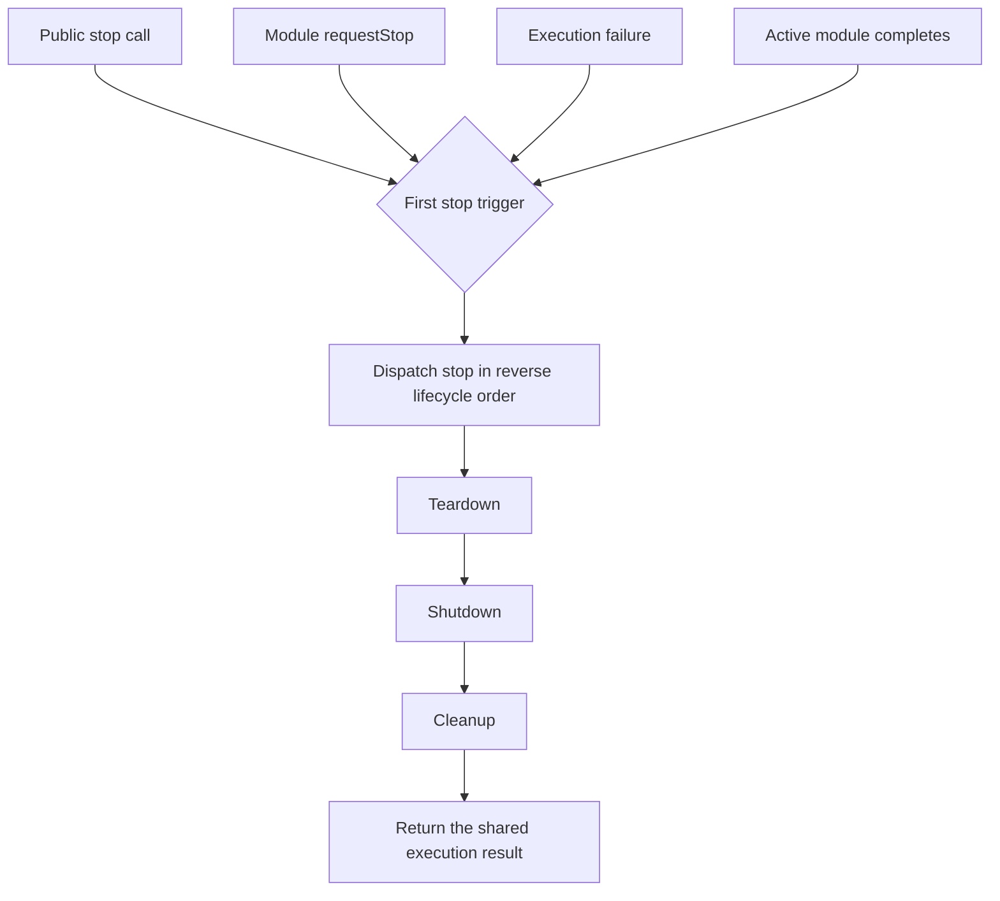

# Stopping and errors

## Request an orderly stop

Call `stop()` after execution has started. It requests an orderly unwind. Await the promise returned by `serve()` or `run(main)` to receive the final result:

import Tabs from '@theme/Tabs';
import TabItem from '@theme/TabItem';

<Tabs groupId="language">
<TabItem value="typescript" label="TypeScript">

```ts
const execution = service.serve();

process.once('SIGTERM', () => {
	service.stop();
});

const result = await execution;
process.exitCode = result.exitCode;
```

</TabItem>
<TabItem value="rust" label="Rust">

```rust
use microde_microservice::MicrodeStopRequest;

let execution = service.serve();
service.stop(MicrodeStopRequest::success());
let result = execution.await?;
assert_eq!(result.exit_code, 0);
```

</TabItem>
</Tabs>

You can request a particular exit code, associate an error with the stop, or provide both:

<Tabs groupId="language">
<TabItem value="typescript" label="TypeScript">

```ts
service.stop(2);
service.stop(new Error('lost connection'));
service.stop(2, new Error('invalid configuration'));
```

</TabItem>
<TabItem value="rust" label="Rust">

```rust
service.stop(MicrodeStopRequest::with_exit_code(2));
service.stop(MicrodeStopRequest::with_error(
    MicrodeError::new("lost connection"),
));
service.stop(MicrodeStopRequest::with_exit_code_and_error(
    2,
    MicrodeError::new("invalid configuration"),
));
```

</TabItem>
</Tabs>

Only the first stop request supplies the requested exit code and error. Calling `stop()` before the service starts throws.



Every orderly trigger joins the same unwind path. Multiple callers waiting on
`serve()`, `run(main)`, or Rust's `stop()` receive the same completed result.

## Handle lifecycle failures

Lifecycle failures do not reject the main execution promise. Inspect the returned result after cleanup finishes:

<Tabs groupId="language">
<TabItem value="typescript" label="TypeScript">

```ts
const result = await service.serve();

if (result.errors) {
	for (const error of result.errors) {
		console.error(error);
	}
} else if (result.error !== undefined) {
	console.error(result.error);
}
```

</TabItem>
<TabItem value="rust" label="Rust">

```rust
let result = service.serve().await?;

if let Some(errors) = result.errors {
    for error in errors {
        eprintln!("{error}");
    }
} else if let Some(error) = result.error {
    eprintln!("{error}");
}
```

</TabItem>
</Tabs>

The `errors` array is present only when more than one failure was recorded. `error` contains the primary failure.

## Panic only when immediate exit is required

`panic(error)` logs the error and a trace, then calls `process.exit(1)`. Because this bypasses teardown and cleanup, reserve it for conditions where continuing the normal lifecycle is unsafe.
